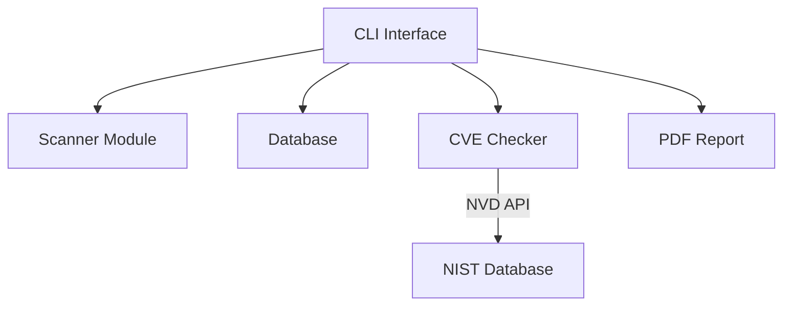

# 🔍 VulnScanner - Professional Network Vulnerability Scanner

[](https://python.org)
[](https://opensource.org/licenses/MIT)
[](https://nmap.org)
[](https://github.com/Jaydon54/VulnScanner)

**VulnScanner** is a professional-grade network vulnerability assessment tool designed for security professionals, system administrators, and small businesses. This Python-based scanner combines the power of Nmap with CVE database integration to deliver comprehensive security reports.

## 🚀 Key Features

- **Three Scan Modes**: Quick (common ports), Regular (custom ports), Deep (full 65k ports)
- **CVE Integration**: Automatic vulnerability detection using NIST National Vulnerability Database
- **Smart Risk Assessment**: AI-enhanced risk level calculation (Critical/High/Medium/Low)
- **Professional Reporting**: Generate detailed PDF reports with identified vulnerabilities
- **Cross-Platform**: Works on Windows, Linux, and macOS
- **Enterprise-Ready**: SQLite database for scan history and results tracking

## 🛠️ Technology Stack

| Component          | Technology Used |
|--------------------|-----------------|
| Core Scanning      | Python-Nmap     |
| Vulnerability DB   | NIST NVD API    |
| Report Generation  | ReportLab       |
| CLI Interface      | cmd + Colorama  |
| Data Storage       | SQLite3         |

## ⚡ Quick Start

### Prerequisites
- Python 3.8+
- Nmap installed on system
- NIST NVD API key (free tier available)

## 🛠️ Installation

1. **Prerequisites**:
   - Python 3.8+
   - Nmap installed on system
   - NIST API key (free registration)

2. **Installation**:
   ```bash
   git clone https://github.com/Jaydon54/VulnScanner.git
   cd VulnScanner
   pip install -r requirements.txt

3.  **Run**:
    ```bash
    python vulnscanner.py
## 🖥️ Demo:
   ```bash
   
        __      __    _        _____
        \ \    / /   | |      / ____|
         \ \  / /   _| |_ __ | (___   ___ __ _ _ __  _ __   ___ _ __ 
          \ \/ / | | | | '_ \ \___ \ / __/ _` | '_ \| '_ \ / _ \ '__|
           \  /| |_| | | | | |____) | (_| (_| | | | | | | |  __/ |   
            \/  \__,_|_|_| |_|_____/ \___\__,_|_| |_|_| |_|\___|_|   

       ============================================================
       | Vulnerability Scanner v2.0                               |
       | Type help for commands                                   |
       | Type exit to quit                                        |
       ============================================================
    
   
   
   [+] Main Menu [+]
   ------------------------------------------------------------
     • Scan Commands:
       scan quick         - Quick scan on current target
       scan regular       - Custom port scan on current target
       scan deep          - Full port scan on current target
       scan quick <target>    - Quick scan on specific target
       scan regular <target>  - Custom port scan on specific target
       scan deep <target>     - Full port scan on specific target
   ------------------------------------------------------------
     • Target Management:
       set target <IP>       - Set current target
       show target          - Show current target
   ------------------------------------------------------------
     • Results & Reports:
       results             - Show last scan results
       results date <start> <end> - Filter by date
       generate report      - Generate PDF report
   ------------------------------------------------------------
     • System Commands:
       clear               - Clear screen
       help                - Show detailed help
       exit                - Exit VulnScanner
     -----------------------------------------------------------
```
##📊 Features Deep Dive
1. **Intelligent Scanning**
2. **CVE Risk Assessment**
3. **Professional Reporting**

## 🏗️ System Architecture


## 📚 Documentation

### Basic Commands:

| Command           | Description                          | Example                      |
|-------------------|--------------------------------------|------------------------------|
| `scan quick`      | Fast scan of common ports            | `scan quick 192.168.1.1`     |
| `scan regular`    | Custom port scan                     | `scan regular` (prompts for ports) |
| `scan deep`       | Full port scan                       | `scan deep example.com`      |
| `results`        | Show last scan results               | `results`                   |
| `generate report` | Create PDF report of vulnerabilities | `generate report`           |


## 🛡️ Ethical Use

⚠️ **Important**: VulnScanner should only be used on:
- Networks you own
- Systems with explicit permission
- Authorized test environments like scanme.nmap.org

By using this software, you agree to:
1. Not use for illegal activities
2. Obtain proper authorization
3. Respect privacy laws

## 👥 Development Team

| Role             | Contributor       | Focus Area       |
|------------------|-------------------|------------------|
|👨💻 Lead Developer   | Jaydon Christen   | Scanner Core     |
| 🗃️ Database Expert  | Jefferson Morales | CVE Integration |
| 💻 CLI Architect    | Adham Gohar       | User Interface   |

